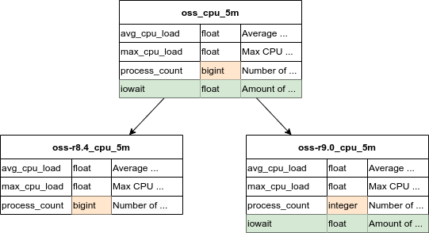

Concurrent Version Control
==========================

Minerva supports concurrent version control for data sources by including the
version in the name of the data source. This way, similar but slightly
different sets of data can be stored without interfering with eachother.

An example of such a situation:

